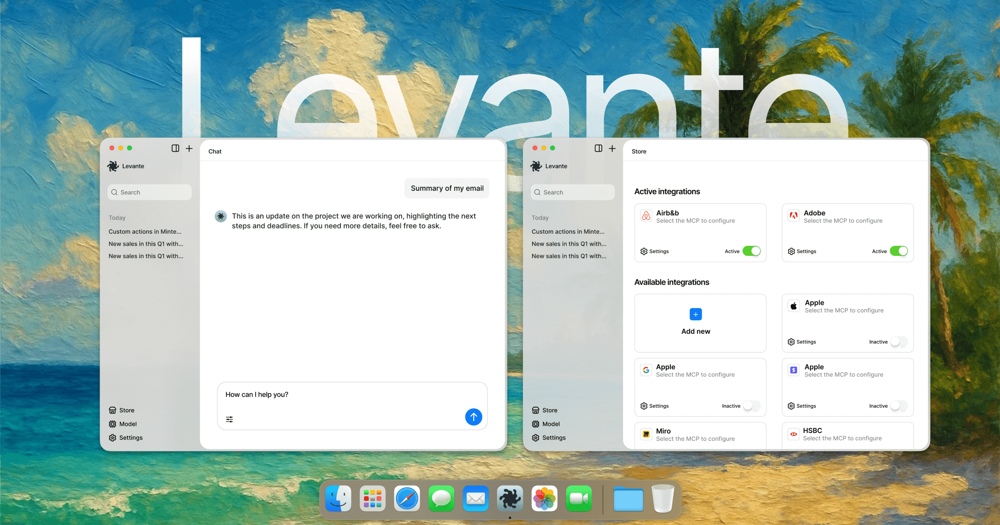

# Levante - Personal, Secure, Free, Local AI



Levante is a cross‑platform desktop app (Windows, macOS, Linux) that brings AI tools closer to everyone, not just technical users. It focuses on privacy, clarity, and ease of use with support for multiple AI providers and the Model Context Protocol (MCP).

## Key Features

### 🎯 Multi-Provider AI Support
- **OpenRouter Integration:** Access 100+ AI models from different providers with a single API key
- **Vercel AI Gateway:** Use enterprise AI routing and fallback systems
- **Local AI Models:** Connect to local services like Ollama, LM Studio, or custom endpoints
- **Cloud Providers:** Direct integration with OpenAI, Anthropic, Google, and more
- **Dynamic Model Management:** Automatically fetch and update available models from your configured providers

### 🔐 Privacy & Security First
- **Local-only storage:** All conversations, settings, and data stay on your device
- **Secure API key management:** Encrypted storage using your system's keychain
- **No telemetry:** Zero data collection or tracking
- **Offline-capable:** Works with local models without internet connection

### 🛠️ Model Context Protocol (MCP) Support
- **MCP Store:** Browse, add, and manage AI tools with explicit consent
- **One-click tool consent:** Clear understanding of what each tool does before execution
- **Audit trail:** Complete history of tool invocations for transparency
- **Sandboxed execution:** Safe tool execution with proper isolation

## 🚀 Getting Started

### Download
*Note: Pre-built releases are coming soon. Currently available as source code for developers.*

| Platform | Status |
|----------|--------|
| Windows  | 🔧 In Development |
| macOS    | 🔧 In Development |
| Linux    | 🔧 In Development |

### Quick Setup
1. **Choose Your AI Provider:**
   - Create an [OpenRouter account](https://openrouter.ai) for easy access to 100+ models
   - Or use your existing OpenAI, Anthropic, or Google API keys
   - Or set up local models with Ollama

2. **Configure in App:**
   - Open Model Settings in the app
   - Add your API key(s)
   - Select which models you want to use
   - Start chatting!

3. **Privacy-First Design:**
   - All data stays on your device
   - API keys are encrypted and stored securely
   - No account registration required

## 🗺️ Current Status

### ✅ Implemented Features
- Multi-provider AI integration (OpenRouter, Vercel AI Gateway, Local, Cloud)
- Secure API key management with encryption
- Dynamic model fetching and selection
- Local SQLite database for conversations
- Real-time chat streaming
- Cross-platform Electron app foundation

### 🔧 In Development
- MCP (Model Context Protocol) integration
- Auto-update system
- File upload and document analysis
- Voice input and output
- Long-term memory (RAG)

## Links
- [Documentation](./docs/)
- [Changelog](./docs/changelog.md)
- Discord
- Bugs Github
- [Contact](https://levante.app/contact)


## 💻 For Developers

### Tech Stack
- **Framework:** Electron with secure IPC architecture
- **Frontend:** React + TypeScript with Zustand state management
- **AI Integration:** Vercel AI SDK for multi-provider support
- **Database:** SQLite (Turso-compatible) for local storage
- **Security:** Encrypted keychain storage for API keys
- **Architecture:** Hexagonal/Clean Architecture with ports & adapters

### Development Commands
```bash
pnpm install    # Install dependencies
pnpm dev        # Run app in development mode
pnpm build      # Production build
pnpm package    # Create installers for current OS
```

## How to Contribute

We welcome contributions from the community! Here's how to get started:

### Reporting Issues
- Search existing issues before opening a new one
- Include steps to reproduce, expected vs actual behavior
- Attach relevant logs/screenshots if possible
- Use the appropriate issue template (bug/feature request)

### Development Workflow
1. Fork the repository
2. Create a feature branch (`git checkout -b feat/your-feature`)
3. Commit your changes (`git commit -m 'feat: add new feature'`)
4. Push to the branch (`git push origin feat/your-feature`)
5. Open a Pull Request

### Code Guidelines
- Follow existing code style and patterns
- Include tests for new features
- Keep commits atomic and well-described
- Reference related issues in PR description

### Getting Help
- Join our [Discord](https://discord.gg/levante) for discussions
- Check the [documentation](./docs/) for architecture and ADRs
- Comment on issues if you need clarification


## License

Apache 2.0 with Commons Clause (no right to Sell). For any commercial use, request permission at `support@levante.app`. See `LICENSE`, `COMMERCIAL-LICENSE.md`, and `docs/LEGAL/LICENSING.md`.

