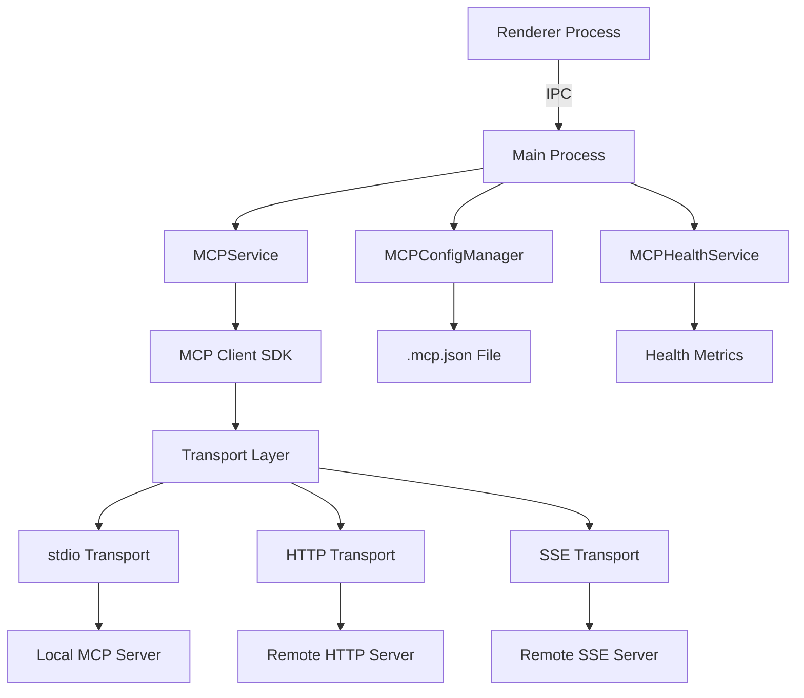
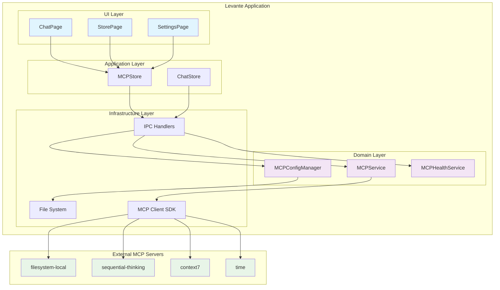
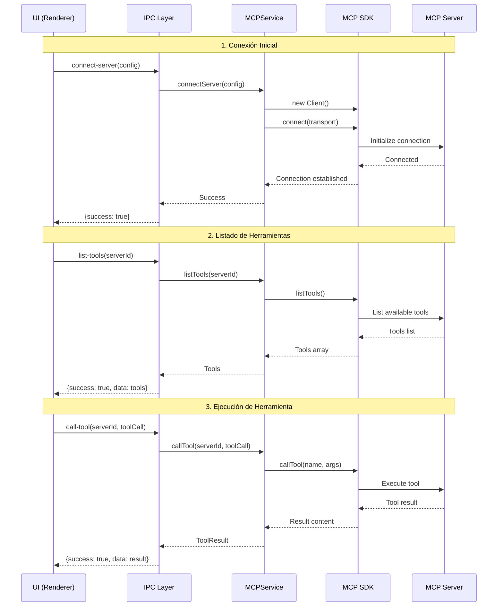
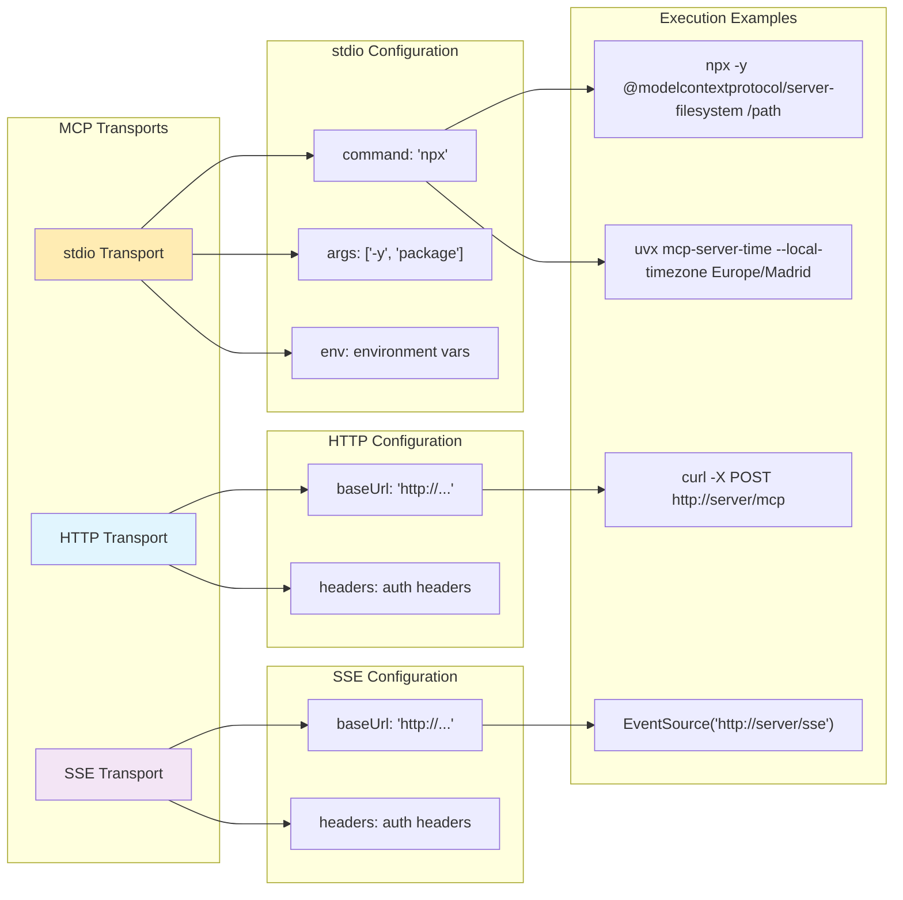

# Integración MCP en Levante
## Documento de Presentación para Reuniones

### Índice
1. [Arquitectura de la Integración](#arquitectura-de-la-integración)
2. [Diagramas de Visualización](#diagramas-de-visualización)
3. [Retos en Sistemas Operativos Locales](#retos-en-sistemas-operativos-locales)
4. [Formato mcp.json y Compatibilidad](#formato-mcpjson-y-compatibilidad)

---

## Arquitectura de la Integración

### Visión General
Levante integra el Model Context Protocol (MCP) para permitir que los modelos de IA accedan a herramientas externas de forma segura y auditada. La integración sigue una arquitectura modular que separa la gestión de servidores MCP, la ejecución de herramientas y la interfaz de usuario.

### Componentes Principales

#### 1. **MCPService** (`src/main/services/mcpService.ts`)
- **Responsabilidad**: Gestión del ciclo de vida de conexiones MCP
- **Características**:
  - Soporte para múltiples transportes: stdio, HTTP, SSE
  - Resolución automática de comandos (npx, uvx)
  - Diagnóstico del sistema para compatibilidad
  - Gestión de errores con mensajes específicos
  - Registry de paquetes MCP conocidos

#### 2. **MCPConfigurationManager** (`src/main/services/mcpConfigManager.ts`)
- **Responsabilidad**: Persistencia y gestión de configuraciones
- **Características**:
  - Gestión del archivo `.mcp.json`
  - Operaciones CRUD para servidores
  - Importación/exportación de configuraciones
  - Validación de formato

#### 3. **MCPHealthService** (`src/main/services/mcpHealthService.ts`)
- **Responsabilidad**: Monitoreo de salud de servidores
- **Características**:
  - Tracking de éxitos/errores por servidor y herramienta
  - Marcado automático de servidores no saludables
  - Métricas de rendimiento
  - Limpieza automática de datos antiguos

#### 4. **IPC Handlers** (`src/main/ipc/mcpHandlers.ts`)
- **Responsabilidad**: Comunicación entre proceso principal y renderer
- **Operaciones**: 43 handlers para todas las operaciones MCP

### Flujo de Datos



---

## Diagramas de Visualización

### 1. Arquitectura Hexagonal de MCP



### 2. Flujo de Conexión y Ejecución de Herramientas



### 3. Gestión de Transportes MCP



---

## Retos en Sistemas Operativos Locales

### 1. **Resolución de Comandos stdio**

#### Problema Principal
Los servidores MCP que utilizan transporte stdio requieren ejecutar comandos del sistema (npx, uvx, python). En diferentes sistemas operativos, estos comandos pueden estar en ubicaciones distintas o no estar disponibles en el PATH.

#### Retos Específicos por SO

##### **macOS**
- **Homebrew vs System Installs**: 
  - Intel Macs: `/usr/local/bin`
  - Apple Silicon: `/opt/homebrew/bin`
- **Node Version Managers**: n, nvm, fnm crean rutas dinámicas
- **Solution**: Path detection automático con fallbacks

```typescript
// Ubicaciones comunes detectadas automáticamente
const fallbackPaths = [
  "/usr/local/bin/npx",      // Homebrew Intel
  "/opt/homebrew/bin/npx",   // Homebrew Apple Silicon  
  path.join(process.env.HOME || "", "n/bin/npx"), // n version manager
];
```

##### **Windows**
- **NPX Paths**: `C:\Users\{user}\AppData\Roaming\npm\npx.cmd`
- **Python/uvx**: Multiple possible installation locations
- **Electron Context**: Limited system PATH access
- **Solution**: Registry lookup + common paths

##### **Linux**
- **Distribution Differences**: Ubuntu vs Fedora vs Arch package locations
- **Package Manager Variations**: apt, yum, pacman install to different locations
- **User vs System Installs**: `/usr/local/bin` vs `~/.local/bin`

#### Implementación de Solución

```typescript
private async resolveCommand(command: string, args: string[] = []): Promise<{command: string; args: string[]}> {
  // 1. Intento con 'which' command
  try {
    const { stdout } = await execAsync(`which ${command}`);
    if (stdout.trim()) return { command: stdout.trim(), args };
  } catch {}
  
  // 2. Fallback a ubicaciones conocidas por SO
  const fallbacks = this.getSystemSpecificPaths(command);
  for (const path of fallbacks) {
    if (await this.pathExists(path)) {
      return { command: path, args };
    }
  }
  
  // 3. Error informativo con recomendaciones
  throw new Error(`Command not found: ${command}. Please install required dependencies.`);
}
```

### 2. **Gestión de Dependencias**

#### NPX Package Resolution
- **Dynamic Downloads**: `npx -y package` descarga al ejecutar
- **Network Requirements**: Requiere conexión a internet
- **Version Conflicts**: Diferentes versiones pueden causar incompatibilidades
- **Cache Issues**: NPX cache puede corromperse

#### Python/UVX Challenges
- **Python Version Dependencies**: MCP servers pueden requerir Python 3.8+
- **Virtual Environment Isolation**: uvx maneja entornos automáticamente
- **Package Installation**: Descarga automática vs pre-instalación

### 3. **Seguridad y Sandboxing**

#### Electron Security Context
- **Node Integration**: Proceso principal tiene acceso completo al sistema
- **Command Execution**: spawn/exec pueden ser vectores de ataque
- **Environment Variables**: Exposición accidental de secretos

#### Mitigación Implementada
```typescript
// Environment sanitization
const env = {
  ...process.env,
  ...config.env,
  PATH: this.getEnhancedPath(), // Controlled PATH
  // Remove sensitive vars
  OPENAI_API_KEY: undefined,
  ANTHROPIC_API_KEY: undefined,
};
```

### 4. **Diagnostics y Troubleshooting**

#### Sistema de Diagnóstico Automático
```typescript
async diagnoseSystem(): Promise<{
  success: boolean;
  issues: string[];
  recommendations: string[];
}> {
  const issues: string[] = [];
  const recommendations: string[] = [];

  // Check Node.js installation
  try {
    await execAsync("node --version");
  } catch {
    issues.push("Node.js is not installed or not in PATH");
    recommendations.push("Install Node.js from https://nodejs.org/");
  }
  
  // More checks...
  return { success: issues.length === 0, issues, recommendations };
}
```

---

## Formato mcp.json y Compatibilidad

### 1. **Estructura del Archivo .mcp.json**

El archivo `.mcp.json` es el estándar de facto para configurar servidores MCP. Levante implementa compatibilidad completa con este formato para asegurar interoperabilidad.

#### Ubicación del Archivo
- **Levante**: `~/Library/Application Support/Levante/.mcp.json` (macOS)
- **Claude Desktop**: `~/Library/Application Support/Claude/.mcp.json`
- **Otros clientes MCP**: Varían según implementación

#### Estructura Básica
```json
{
  "mcpServers": {
    "server-id": {
      "type": "stdio",
      "command": "npx",
      "args": ["-y", "@modelcontextprotocol/server-package"],
      "env": {
        "CUSTOM_VAR": "value"
      }
    }
  }
}
```

### 2. **Configuraciones por Tipo de Transporte**

#### stdio Transport
```json
{
  "mcpServers": {
    "filesystem-local": {
      "type": "stdio",
      "command": "npx", 
      "args": ["-y", "@modelcontextprotocol/server-filesystem", "/allowed/path"],
      "env": {
        "NODE_ENV": "production"
      }
    },
    "time-server": {
      "type": "stdio", 
      "command": "uvx",
      "args": ["mcp-server-time", "--local-timezone", "Europe/Madrid"],
      "env": {}
    }
  }
}
```

#### HTTP Transport (Extensión Levante)
```json
{
  "mcpServers": {
    "remote-api": {
      "type": "http",
      "baseUrl": "https://api.example.com/mcp",
      "headers": {
        "Authorization": "Bearer token",
        "Content-Type": "application/json"
      }
    }
  }
}
```

#### SSE Transport (Extensión Levante)
```json
{
  "mcpServers": {
    "sse-stream": {
      "type": "sse", 
      "baseUrl": "https://api.example.com/mcp/stream",
      "headers": {
        "Authorization": "Bearer token"
      }
    }
  }
}
```

### 3. **Compatibilidad entre Clientes**

#### Levante ↔ Claude Desktop
- **Compatibilidad Lectora**: Levante puede leer configuraciones de Claude Desktop
- **Compatibility de Escritura**: Archivos escritos por Levante son compatibles con Claude
- **Extensiones Levante**: HTTP/SSE transportes no son soportados por Claude Desktop

#### Migración Automática
```typescript
// Import configuration from Claude Desktop
async importClaudeConfig(): Promise<void> {
  const claudeConfigPath = path.join(
    os.homedir(), 
    'Library/Application Support/Claude/.mcp.json'
  );
  
  if (await fs.pathExists(claudeConfigPath)) {
    const claudeConfig = await fs.readJSON(claudeConfigPath);
    await this.importConfiguration(claudeConfig);
  }
}
```

### 4. **Validación y Schema**

#### Validación de Configuración
```typescript
interface MCPServerConfig {
  id: string;
  name?: string;
  // stdio fields
  command?: string;
  args?: string[];
  env?: Record<string, string>;
  // http/sse fields  
  baseUrl?: string;
  headers?: Record<string, string>;
  // Required
  transport: 'stdio' | 'http' | 'sse';
}
```

#### Registry de Paquetes Conocidos
```json
{
  "version": "1.0.0",
  "lastUpdated": "2025-01-14", 
  "entries": [
    {
      "id": "filesystem-local",
      "name": "Local File System", 
      "npmPackage": "@modelcontextprotocol/server-filesystem",
      "status": "active",
      "version": "2025.8.21"
    }
  ],
  "deprecated": [
    {
      "id": "sqlite",
      "name": "SQLite Database",
      "npmPackage": "@modelcontextprotocol/server-sqlite", 
      "reason": "Package never existed",
      "alternative": "@modelcontextprotocol/server-memory"
    }
  ]
}
```

### 5. **Operaciones de Configuración**

#### Import/Export
```typescript
// Export current configuration
const config = await mcpConfigManager.exportConfiguration();

// Import configuration from file 
await mcpConfigManager.importConfiguration(importedConfig);

// Merge configurations
const mergedConfig = {
  mcpServers: {
    ...currentConfig.mcpServers,
    ...importedConfig.mcpServers
  }
};
```

#### Configuration Persistence
- **Atomic Writes**: Configuración se guarda atómicamente
- **Backup on Change**: Backup automático antes de modificaciones
- **Format Validation**: Validación antes de guardar
- **Error Recovery**: Recuperación automática en caso de corrupción

---

## Conclusiones

### Ventajas de la Implementación
1. **Compatibilidad Total**: Soporte completo para el estándar mcp.json
2. **Multi-Transport**: stdio, HTTP, SSE en un solo sistema
3. **Cross-Platform**: Funciona en macOS, Windows, Linux
4. **Health Monitoring**: Monitoreo automático de servidores
5. **Error Recovery**: Diagnóstico y recuperación automática

### Próximos Desarrollos
1. **Auto-Discovery**: Detección automática de servidores locales
2. **Security Sandbox**: Mayor aislamiento de seguridad
3. **Performance Optimization**: Cache de conexiones y herramientas
4. **UI Enhancements**: Mejor experiencia de configuración

La integración MCP en Levante representa una implementación robusta y extensible que balancea seguridad, compatibilidad y facilidad de uso, estableciendo un nuevo estándar para clientes MCP de escritorio.